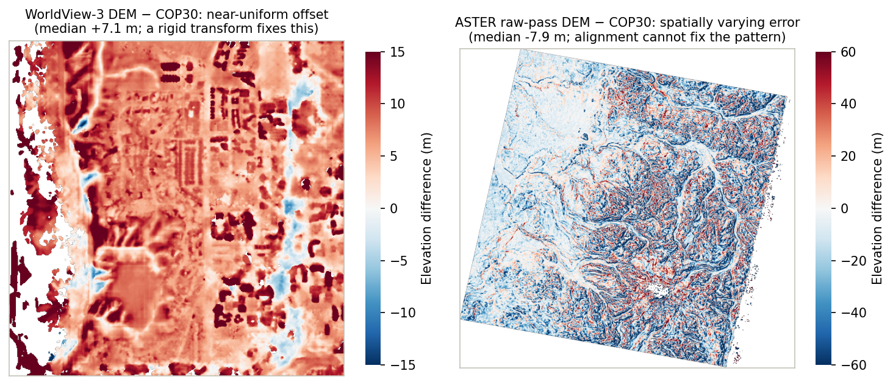

# Alignment

Even a clean stereo DEM usually sits slightly off true ground, because small camera-model errors translate into a shift of the whole surface. `pc_align` removes that shift by registering the DEM to a trusted reference.

## The reference dataset

ICESat-2 ATL06-SR for Earth, MOLA for Mars, LOLA for the Moon, or any prior high-quality DEM (3DEP, ArcticDEM, regional lidar). A good reference does not need to be dense; it needs to be accurate and to sample stable terrain. A few thousand well-placed altimetry points constrain a rigid shift better than a dense but biased DEM.

## What `pc_align` does

The algorithm is iterative closest point (ICP): pair each point of your DEM with the nearest reference point, find the rigid transformation (rotation and translation; a translation-only or scale-solving variant if you ask for one) that minimizes those distances, apply it, and repeat until the fit stops improving. The output is your DEM moved onto the reference.


## When it helps and when it doesn't

`pc_align` fixes what a rigid move can fix: near-uniform bias and small global tilt. It cannot fix localized blunders, matching noise, or non-rigid warp; those need attention upstream (better bundle adjustment, better stereo parameters, or better input imagery). The difference-to-reference maps below, both from tutorial runs, show the two cases:



If the difference map against the reference still shows structure after alignment, the problem is not alignment.

## Reading the alignment report

`pc_align` prints percentile breakdowns of the point-to-reference distances before and after alignment, plus the transformation it applied. From a run of the WorldView tutorial's DEM against its COP30 reference:

```text
Input:  error percentile of smallest errors (meters): 16%: 3.87315,  50%: 7.13745, 84%: 11.2421
Output: error percentile of smallest errors (meters): 16%: 0.574244, 50%: 2.08287, 84%: 5.95369
Translation vector (North-East-Down, meters): Vector3(2.1610355,3.4450347,7.0166972)
Translation vector magnitude (meters): 8.1100172
```

Three things to read off:

- The 50% lines are the headline metric: the median point-to-reference distance dropped from about 7 m to about 2 m.
- The translation vector says where the DEM moved: here mostly down by 7 m, with a couple of meters horizontally. It should be a plausible magnitude for your sensor.
- A median that barely drops, or a huge translation, means the DEM and reference disagree in a way ICP cannot reconcile; check the vertical datums and the overlap area first.

## Alignment inside `asp-plot`

The `asp_plot` CLI runs `pc_align` by default (the `--pc_align` option, on unless altimetry plotting is disabled) against the appropriate altimetry reference for the body (ICESat-2 for Earth, MOLA for Mars, LOLA for the Moon) and appends alignment-report pages to the PDF. This is how the WorldView tutorial aligns its DEM: its report command runs `pc_align` without any extra flag.

## Where to read more

- [ASP pc_align docs](https://stereopipeline.readthedocs.io/en/latest/tools/pc_align.html)
