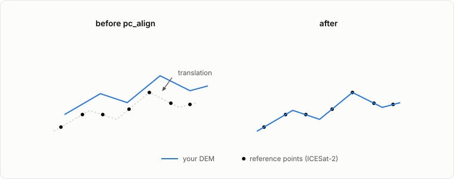

# Alignment

```{admonition} Work in progress
:class: warning
Some figures on this page still need full processing runs to produce.
```

Even a clean stereo DEM usually sits slightly off true ground, because small camera-model errors translate into a shift of the whole surface. `pc_align` removes that shift by registering the DEM to a trusted reference.

## The reference dataset

ICESat-2 ATL06-SR for Earth, MOLA for Mars, LOLA for the Moon, or any prior high-quality DEM (3DEP, ArcticDEM, regional lidar). A good reference does not need to be dense; it needs to be accurate and to sample stable terrain. A few thousand well-placed altimetry points constrain a rigid shift better than a dense but biased DEM.

## What `pc_align` does

The algorithm is iterative closest point (ICP): pair each point of your DEM with the nearest reference point, find the rigid transformation (translation, optionally rotation and scale) that minimizes those distances, apply it, and repeat until the fit stops improving. The output is your DEM moved onto the reference.



## When it helps and when it doesn't

<!-- FIGURE IDEA: two dh maps side by side — one dominated by a constant offset (pc_align fixes this) and one dominated by spatially-varying noise (pc_align cannot fix this). Caption: rigid bias vs localized errors. -->

`pc_align` fixes what a rigid move can fix: near-uniform bias and small global tilt. It cannot fix localized blunders, matching noise, or non-rigid warp; those need attention upstream (better bundle adjustment, better stereo parameters, or better input imagery). If the difference map against the reference still shows structure after alignment, the problem is not alignment.

## Reading the alignment report

<!-- FIGURE IDEA: example pc_align stdout snippet (Beg/End errors percentiles + translation vector) annotated with arrows pointing to the median, the translation magnitude, and what to do if the median doesn't drop. -->

`pc_align` prints percentile breakdowns of the point-to-reference distances before and after alignment, plus the transformation it applied. The headline metric is the drop in the median (50th percentile) distance. Also sanity-check the translation vector: it should be a plausible magnitude for your sensor. A median that barely drops, or a huge translation, means the DEM and reference disagree in a way ICP cannot reconcile; check the vertical datums and the overlap area first.

## The `--pc_align` flag in `asp-plot`

`asp_plot --pc_align` runs `pc_align` against the appropriate altimetry reference based on the DEM's CRS and adds an alignment-summary page to the PDF report. This is how the WorldView tutorial aligns its DEM.

## Where to read more

- [ASP pc_align docs](https://stereopipeline.readthedocs.io/en/latest/tools/pc_align.html)
