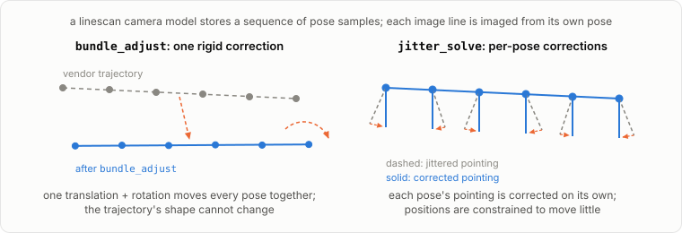

# Bundle adjustment

The vendor's {term}`camera models <camera model>` are slightly inaccurate; bundle adjustment refines them by minimizing {term}`reprojection errors <reprojection error>` of features matched between the input images.

## What the optimizer does

`bundle_adjust` detects {term}`interest points <interest point (IP)>` in each image, matches them across images into {term}`tie points <tie point>`, and then jointly varies the camera parameters and the tie point positions to shrink the reprojection errors: the distance between where each tie point actually appears in an image and where the camera model says it should appear.

## Why this matters for stereo

With misaligned cameras, the two viewing rays for a matched pixel do not quite meet. Triangulation records that miss distance per point as the fourth band of `run-PC.tif` (`point2dem --errorimage` grids it into `run-IntersectionErr.tif`), and the misalignment surfaces in the DEM as bias and tilt. Bundle adjustment shrinks all of these.

## What it looks like on real data

From a `bundle_adjust` run on the [WorldView tutorial's](../tutorials/03_worldview_ucsd_ba.ipynb) stereo pair, the per-tie-point reprojection {term}`residuals <residual>` before and after optimization:

The same residuals in map view over the scene footprint (initial values above 10 px are shown clipped):

Both figures come from the residual point maps `bundle_adjust` writes (`*-initial_residuals_pointmap.csv`, `*-final_residuals_pointmap.csv`), read with `asp_plot.bundle_adjust.PlotBundleAdjustFiles`. Look for two things: the residual hump moving toward zero, and no strong spatial pattern left in the final map.

## What bundle adjustment cannot fix: jitter

A linescan camera model already contains the sensor's full trajectory: a time-sampled sequence of positions and orientations, with each image line imaged from its own interpolated pose. `bundle_adjust` does not touch those samples individually. It solves for one translation and one rotation per camera and applies them to the whole trajectory as a rigid body. That corrects the bulk error in absolute position and pointing, but it has no degrees of freedom to change the trajectory's internal shape.

{term}`Jitter` is the high-frequency error left behind. Vibrations during the scan make the pointing oscillate faster than the sampled trajectory captures, and those oscillations imprint a wavy pattern into the image and the DEM. ASP treats it as a separate problem: `jitter_solve` optimizes the pose samples individually, so it can bend the trajectory to remove the line-to-line perturbation.

|  | `bundle_adjust` | `jitter_solve` |
|---|---|---|
| Free parameters per camera | one position + one orientation | a sequence of positions and orientations |
| Error corrected | bulk, low-frequency position and pointing | high-frequency along-track oscillation |
| Output | `.adjust` file (translation + rotation) | full CSM camera state |
| Typical order | first | after bundle adjustment |

`jitter_solve` normally starts from bundle adjustment's output, works only with {term}`CSM` cameras, and needs constraints (anchor points, camera position uncertainties) to keep its many free parameters stable. The tutorials here do not run it; the [`asp-plot` example notebooks](https://asp-plot.readthedocs.io/en/latest/examples/index.html) include a jitter correction walkthrough.

## Where to read more

- [ASP bundle_adjust docs](https://stereopipeline.readthedocs.io/en/latest/tools/bundle_adjust.html)
- [ASP jitter_solve docs](https://stereopipeline.readthedocs.io/en/latest/tools/jitter_solve.html)
- [Bundle adjustment in the ASP workflow](https://stereopipeline.readthedocs.io/en/latest/next_steps.html)
