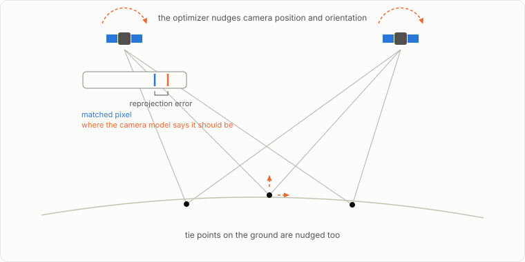
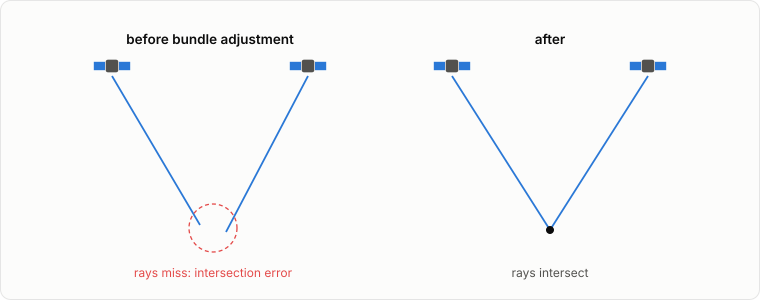
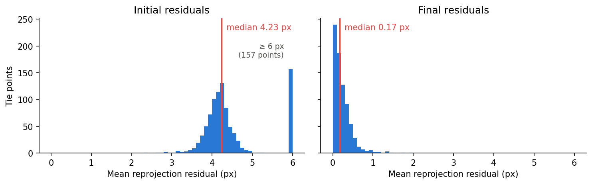
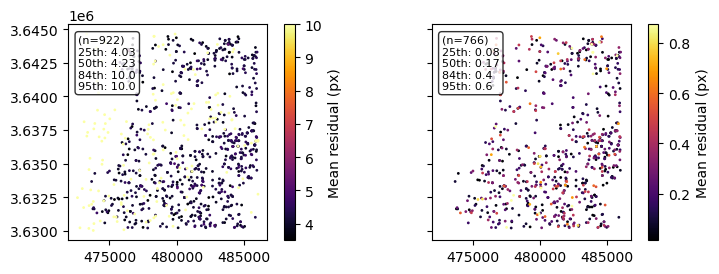

# Bundle adjustment

The vendor's camera models are slightly inaccurate; bundle adjustment refines them by minimizing reprojection errors of features matched between the input images.

## What the optimizer does

`bundle_adjust` detects interest points in each image, matches them across images into tie points, and then jointly varies the camera parameters and the tie point positions to shrink the reprojection errors: the distance between where each tie point actually appears in an image and where the camera model says it should appear.

## Why this matters for stereo

With misaligned cameras, the two viewing rays for a matched pixel do not quite meet; `parallel_stereo` records that miss distance per pixel in `run-IntersectionErr.tif`, and the misalignment surfaces in the DEM as bias and tilt. Bundle adjustment shrinks all three.

## What it looks like on real data

From a `bundle_adjust` run on the [WorldView tutorial's](../tutorials/03_worldview_ucsd_ba.ipynb) stereo pair, the per-tie-point reprojection residuals before and after optimization:

The same residuals in map view over the scene footprint (initial values above 10 px are shown clipped):

Both figures come from the residual point maps `bundle_adjust` writes (`*-initial_residuals_pointmap.csv`, `*-final_residuals_pointmap.csv`), read with `asp_plot.bundle_adjust.PlotBundleAdjustFiles`. Look for two things: the residual hump moving toward zero, and no strong spatial pattern left in the final map.

## Common knobs

Interest-point density (`--ip-per-image`, `--ip-per-tile`), tie-point penalty (`--tri-weight`, `--tri-robust-threshold`), and camera-anchor weight (`--camera-weight`) are the parameters most often tuned.

## Where to read more

- [ASP bundle_adjust docs](https://stereopipeline.readthedocs.io/en/latest/tools/bundle_adjust.html)
- [Bundle adjustment in the ASP workflow](https://stereopipeline.readthedocs.io/en/latest/next_steps.html)
