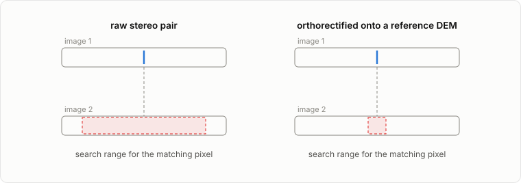
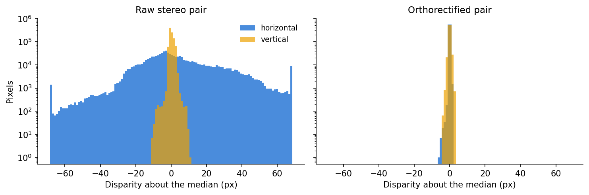
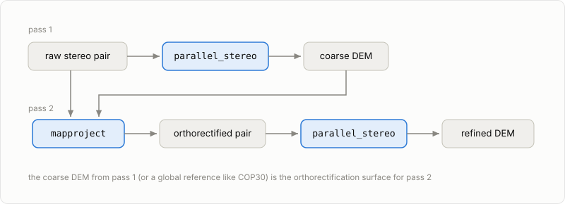
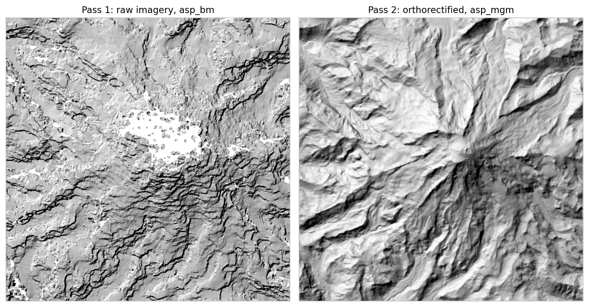

# Orthorectification

```{note}
ASP calls this step "mapprojection" in its toolchain (the binary is `mapproject`, the bundle-adjust flag is `--mapproj-dem`). This guide uses "orthorectification" — the more standard photogrammetry term — for the concept while keeping ASP's tool names verbatim.
```

Resampling each input image onto a reference DEM grid before stereo turns a wide-search-range matching problem into a small-disparity one.

## The intuition

Raw images of the same terrain from two viewpoints differ a lot: the satellite geometry shifts every pixel, and relief shifts them further. To find a pixel's match, the correlator has to search a wide range, which is slow and error-prone. Orthorectifying both images onto the same reference DEM removes most of that geometric difference up front, so the correlator only searches a small range around each pixel.



Measured on the ASTER tutorial pair, run both ways: the disparity spread the correlator has to cover collapses from tens of pixels to about one.



After orthorectification, the residual disparity is dominated by error in the reference DEM (small) rather than satellite geometry (large).

## When you can skip it

Very flat terrain, missing reference DEMs, or quick first passes can use ASP's `--alignment-method affineepipolar` instead, which aligns the images with a single image-wide transformation rather than a per-pixel one. The ASTER tutorial's first pass runs this way.

## What reference DEM to use

| Reference | Coverage | Notes |
|---|---|---|
| [Copernicus GLO-30](https://registry.opendata.aws/copernicus-dem/) | global | free on AWS Open Data; what the tutorials fetch |
| [USGS 3DEP](https://www.usgs.gov/3d-elevation-program) | United States | lidar-derived, high resolution |
| [ArcticDEM](https://www.pgc.umn.edu/data/arcticdem/) | Arctic | WorldView-derived strips and mosaics |
| [REMA](https://www.pgc.umn.edu/data/rema/) | Antarctica | WorldView-derived strips and mosaics |
| MOLA | Mars | mission altimetry |
| LOLA | Moon | mission altimetry |

One pitfall: ASP expects DEM heights above the ellipsoid, but many products (including COP30) ship heights above a geoid. Feeding a geoid-referenced DEM to `mapproject` injects a vertical bias of tens of meters. The tutorials' `fetch_cop_dem.py` script applies the geoid-to-ellipsoid shift for you; if you bring your own reference DEM, check its vertical datum first.

## The two-pass trick

When you have no good reference DEM, make your own: run a coarse first stereo pass on the raw imagery, then orthorectify against that DEM and re-run stereo. Your own first-pass DEM is more locally accurate than a global reference.



The [ASTER tutorial](../tutorials/01_aster_rainier.ipynb) runs this pattern with COP30 as the second-pass surface, producing a report for each pass so you can compare them. The hillshades below are the two passes over the Mount Rainier massif: the raw pass loses the snow-covered upper mountain and smears the valleys; the orthorectified pass recovers both.



## Where to read more

- [ASP mapproject docs](https://stereopipeline.readthedocs.io/en/latest/tools/mapproject.html)
- [ASP stereo with mapprojected images](https://stereopipeline.readthedocs.io/en/latest/examples/aster.html#aster)
