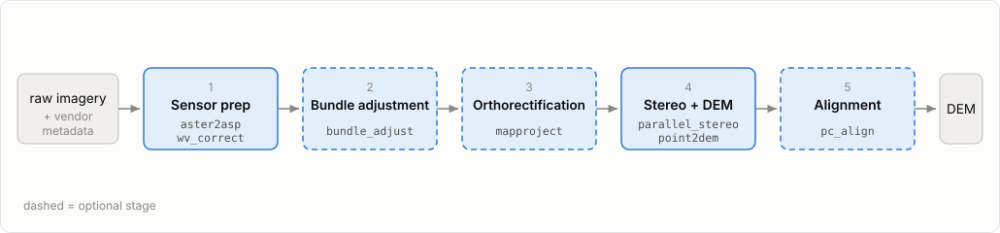
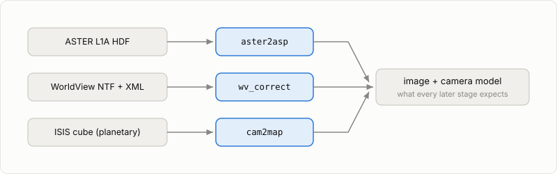
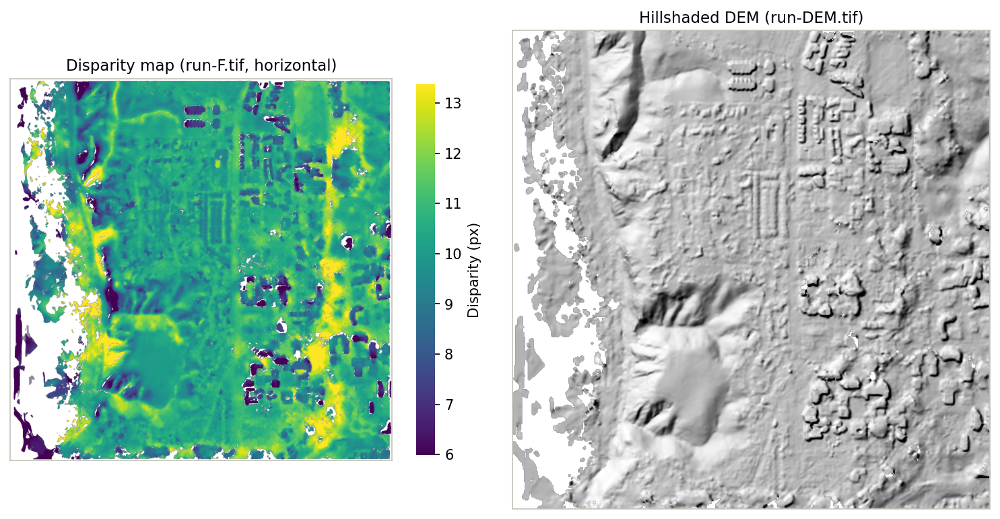

# Pipeline overview

Every ASP run, regardless of sensor, follows the same five-stage pattern.

## The five stages



Sensor prep → bundle adjustment → orthorectification → stereo + DEM generation → alignment. The dashed stages are optional: the simplest possible run is `parallel_stereo` followed by `point2dem`, and each optional stage buys accuracy at the cost of another step. The tutorials show both: the ASTER notebook starts with the minimal run, then adds orthorectification; the WorldView notebooks add alignment and bundle adjustment.

## Stage 1: Sensor preparation



Vendor-specific tools (`aster2asp`, `wv_correct`, `cam2map`, `dg_mosaic`) convert raw vendor data into the standard image-plus-camera pair ASP expects.

## Stage 2: Bundle adjustment

`bundle_adjust` refines the vendor {term}`camera models <camera model>` by minimizing reprojection errors of features matched between the input images. See [Bundle adjustment](bundle-adjustment.md).

## Stage 3: Orthorectification

`mapproject` resamples each input image onto a reference DEM grid so stereo matching has only a small remaining disparity to solve. See [Orthorectification](orthorectification.md).

```{note}
ASP calls this step "mapprojection" in its toolchain (`mapproject`, `--mapproj-dem`). This guide uses "orthorectification" — the more standard photogrammetry term — for the concept while keeping ASP's tool names verbatim.
```

## Stage 4: Stereo + DEM generation

`parallel_stereo` matches pixels between the two images and triangulates them into a {term}`point cloud`; `point2dem` grids the cloud into a regular DEM. The heights are of whatever surface the cameras saw, rooftops and tree canopy included, so the product is strictly a digital surface model ({term}`DSM`); this guide follows ASP in calling it a DEM. From the WorldView tutorial, the {term}`disparity map` and the DEM it becomes:



See [Stereo photogrammetry](stereo-photogrammetry.md).

## Stage 5: Alignment

`pc_align` registers the DEM to a trusted reference ({term}`ICESat-2`, {term}`MOLA`, {term}`LOLA`, or another DEM) using {term}`ICP`. See [Alignment](alignment.md).

## What `asp-plot` does at every stage

Each ASP stage produces files; [`asp-plot`](https://asp-plot.readthedocs.io/en/latest/) reads them and produces diagnostic plots and PDF reports. See [Visualization](visualization.md).
