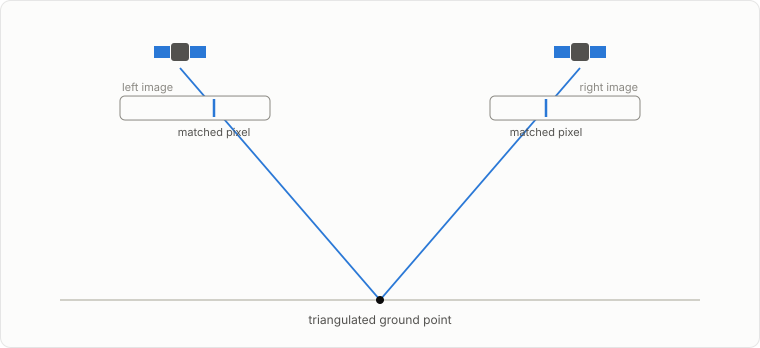
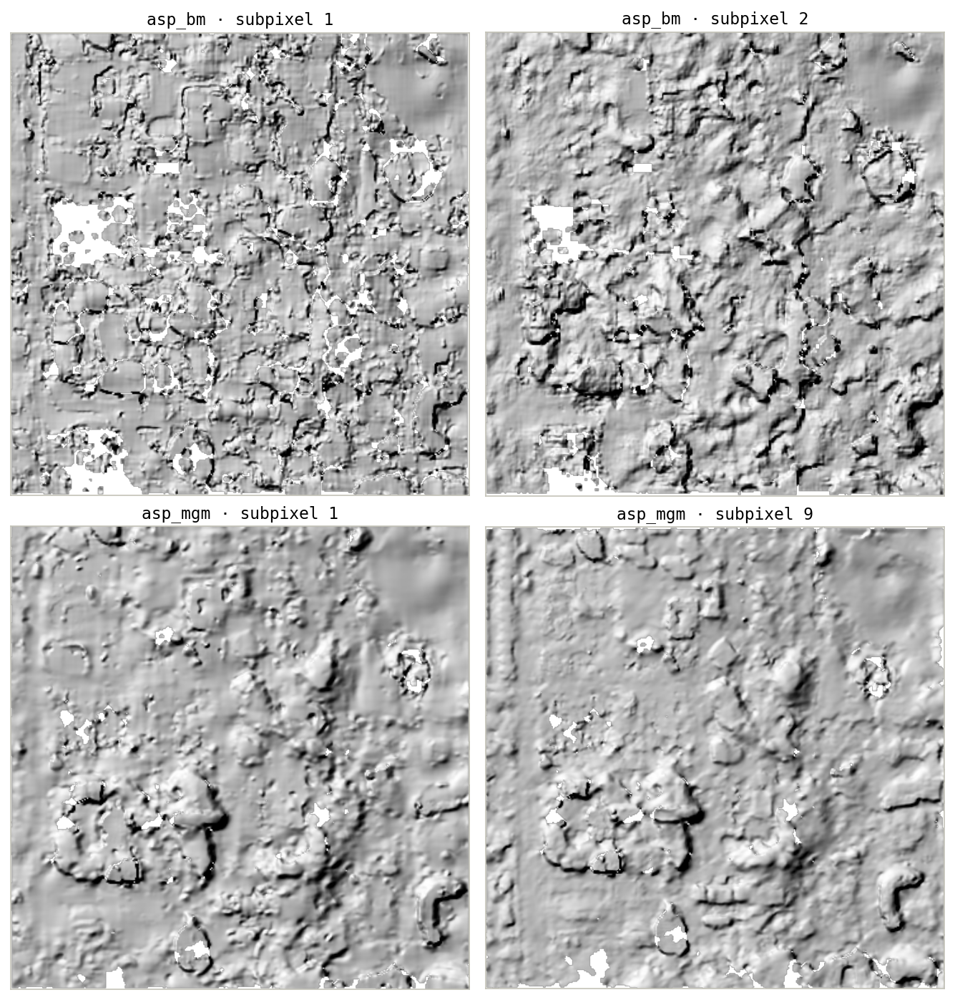
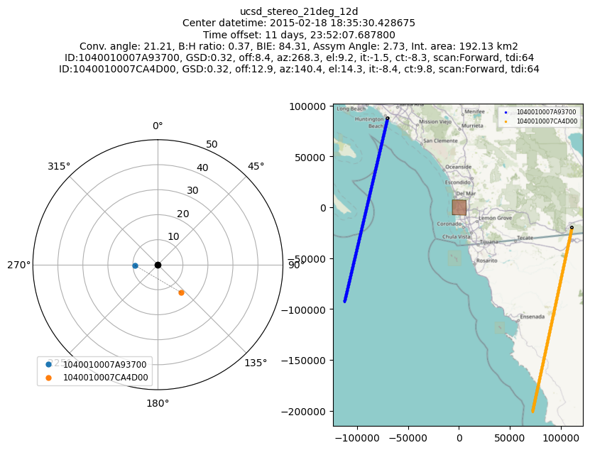
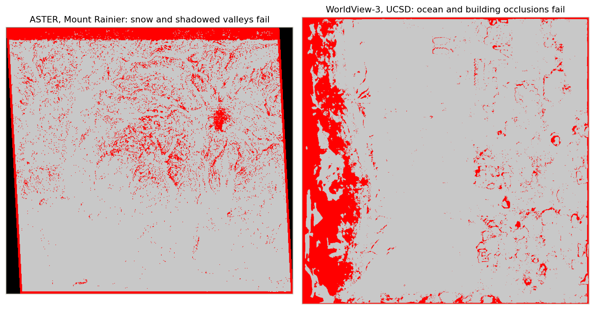

# Stereo photogrammetry

Two views of the same patch of ground from different angles produce {term}`parallax`: a pixel shift between images that encodes ground height.

## What ASP actually computes

For every pixel in the left image, `parallel_stereo` searches the right image for the best-matching pixel. The result is a {term}`disparity map`: a per-pixel shift between the two images. Triangulation then combines each matched pair with the camera models: the two viewing rays are intersected in space, and the intersection is a 3D ground point.

The triangulated points land in a {term}`point cloud` (`run-PC.tif`), which `point2dem` grids into a DEM. See [Pipeline overview](pipeline-overview.md) for where this sits in the full flow.

## Knobs that matter

The matcher (`--stereo-algorithm`) and the subpixel refiner (`--subpixel-mode`) are the two parameters that most affect quality and runtime. The same 800 m crop of the WorldView tutorial pair, run four ways (`asp_bm` does not support subpixel mode 9, so its quality mode here is 2):

 `asp_bm` is ASP's classic block matcher, fast and effective on well-textured images; `asp_mgm` costs more compute and memory and does better where texture is poor or repetitive. The tutorials pair `asp_bm` with `--subpixel-mode 1` for the quick first ASTER pass and `asp_mgm` with `--subpixel-mode 9` everywhere else; the [ASP correlation docs](https://stereopipeline.readthedocs.io/en/latest/correlation.html) describe the full menu.

## Geometry that matters

Height precision is set before you run anything, by the viewing geometry: the {term}`convergence angle` (the angle between the two viewing rays) and the {term}`base-to-height ratio <base-to-height ratio (B/H)>`. Too little convergence and the rays intersect at a shallow angle, so small matching errors become large height errors; too much and the two images look so different that matching degrades.

Both quantities come from the vendor metadata. `asp_plot.stereo_geometry.StereoGeometryPlotter` reads the camera XMLs and plots them, as run in [the WorldView tutorial](../tutorials/02_worldview_ucsd.ipynb) for its stereo pair:

The skyplot (left) shows where each satellite sat in the sky when it imaged the ground; the map (right) shows the ground tracks and the shared footprint. The header lists the derived quantities, including the convergence angle and base-to-height ratio.

## Where matching fails

Featureless surfaces (open water, fresh snow, sand), repetitive texture, occlusion (one camera sees a slope face the other cannot), clouds, and illumination differences between acquisitions all break the matcher. Failures show up as red in `run-GoodPixelMap.tif` (successful matches are gray) and as voids in the DEM. The maps below are from the two tutorials' raw first runs:

Voids in reasonable places are normal; voids everywhere usually mean a geometry or preprocessing problem, not a matching problem.

## Where to read more

- [ASP stereo correlation docs](https://stereopipeline.readthedocs.io/en/latest/correlation.html)
- [ASP triangulation docs](https://stereopipeline.readthedocs.io/en/latest/tools/parallel_stereo.html)
