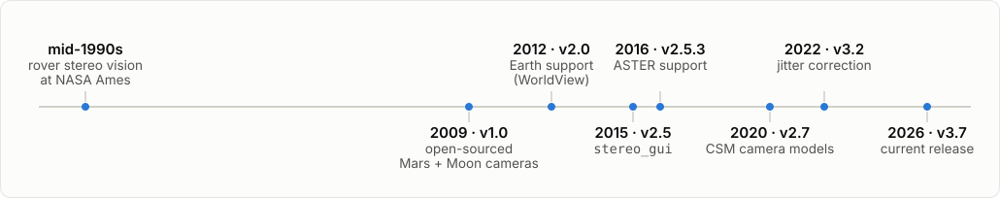
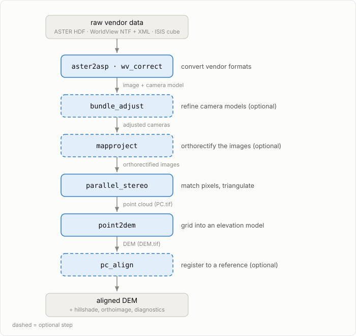
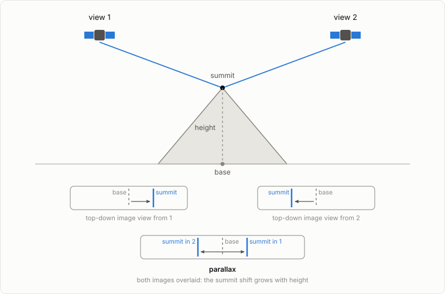

# What is the Ames Stereo Pipeline?

The NASA Ames Stereo Pipeline (ASP) is open-source software that turns pairs (or sets) of overlapping satellite or planetary images into digital elevation models ({term}`DEMs <DEM>`).

## A short history

ASP has been developed at NASA Ames Research Center since the mid-1990s, beginning as stereo vision support for cameras on test rovers. Its first planetary use was the Mars Pathfinder lander's camera in 1997; in 2006 it was adapted to orbital cameras, and in 2009 it was open-sourced as version 1.0 with a planetary focus (Mars and Moon cameras such as HiRISE, CTX, MOC, and Apollo Metric). Earth support followed: WorldView in 2012 and ASTER in 2016, the two sensors this guide's tutorials use. Development continues at NASA Ames, with recent releases adding Community Sensor Model ({term}`CSM`) cameras and {term}`jitter` correction. The software paper is [Beyer et al. (2018)](https://doi.org/10.1029/2018EA000409); releases live on the [ASP GitHub](https://github.com/NeoGeographyToolkit/StereoPipeline/releases).

## A toolchain of modular executables

ASP is not one program. A release ships roughly 80 single-purpose command-line tools that read and write ordinary files: GeoTIFF images, camera-model XML, CSV point lists. Each tool does one job and its output feeds the next, so a full workflow is a short sequence of commands. The diagram shows the seven tools these tutorials use; the [ASP tools chapter](https://stereopipeline.readthedocs.io/en/latest/tools.html) lists the rest.

Every intermediate product lands on disk, so you can inspect each step's output and re-run any single step without redoing the others.

## Command line or GUI?

ASP is driven from the terminal; the one graphical tool is [`stereo_gui`](https://stereopipeline.readthedocs.io/en/latest/tools/stereo_gui.html), an image viewer and front-end to `parallel_stereo`. It can display large images, interest-point matches, and disparities, and can test-run stereo on a small selected clip before you commit to a full scene (it prints the equivalent command when you do).

This guide runs everything as commands in notebooks: a browser Codespace has no desktop to show a GUI window, and the command sequence is the thing worth learning, since it is what you will script when you move to your own data. The inspection role is covered by `asp-plot` figures inline in the notebooks.

## Why "stereo"?

A single satellite image cannot recover height, for the same reason one eye judges depth poorly: depth comes from comparing two views. A second image from a different viewpoint adds the missing information: the same feature lands at different pixel positions in the two images, and that offset ({term}`parallax`) grows with the feature's height. Stereo matching finds the offset for every pixel; triangulation converts offsets into heights. The rest of the pipeline exists to make the matching easier and the heights more accurate.

See [Stereo photogrammetry](../concepts/stereo-photogrammetry.md) for how matching and triangulation work.

## Where `asp-plot` fits

[`asp-plot`](https://asp-plot.readthedocs.io/en/latest/) reads ASP's scattered output files and produces diagnostic figures and PDF reports; it's used at every step of this guide.

## What's next

- [Pipeline overview](../concepts/pipeline-overview.md) — the full flow.
- [Open the Codespace](codespaces.md) — run a real pipeline.
- [ASTER tutorial](../tutorials/01_aster_rainier.ipynb) — gentlest end-to-end notebook.
